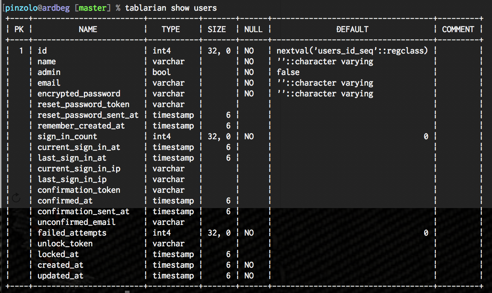

# csvパッケージ

---

# $ `whoami`

* NODA Masato
* @pinzolo
* 株式会社空
* Go歴1年未満
* goroutine 使いこなせていない勢

---

# GO で作ったやつ

---

# tablarian

コマンドラインでテーブル定義引く



---

# csvutil

CSVに対してあれこれできる


```bash
$ csvutil generate --size 5 --count 10 --header 氏名:郵便番号:住所:建物:メール | \
  csvutil name --name 氏名 | \
  csvutil address --zip-code 郵便番号 --prefecture 住所 --city 住所 --town 住所 --block-number | \
  csvutil building --column 建物 | \
  csvutil email --column メール
```

```
氏名,郵便番号,住所,建物,メール
土田 慶太郎,061-8035,京都府和光市西春別駅前西町42-18,プレステージ前河原1926,tempora_doloribus_inventore@twitterbeat.info
古川 篤人,468-2410,長崎県東根市御蔵島村一円16,テラスライフ1421,charlesstevens@eire.mil
横田 姫葵,197-3356,愛知県志木市神田佐久間河岸44-12-6,ソレイユ麻生1229,qjordan@roomm.edu
荻野 吉文,819-3023,東京都大阪市平野区亀尾町44-24-2,グリーンエステート1727,tempore_numquam_consequatur@midel.org
森山 沙江,289-9318,岡山県大阪市東淀川区桜作42-6,グレースヴィレッジ宇和町杢所1118,ucooper@voonder.net
大野 沙祈,093-0401,新潟県河北郡内灘町木興町46-10,パールレジデンス梨ケ原806,victorpierce@dynabox.edu
山崎 玲菜,065-9621,兵庫県大阪市浪速区八幡町39-18,スイートコート光町506,qui_aut_nihil@meeveo.biz
金沢 優二,201-6394,徳島県岩手郡雫石町日置野田36-10,プレステージ八森樋長421,ibell@demizz.com
松原 誠吾,877-1329,石川県吉野郡野迫川村灘38-5-10,ガーデンタワー藤河内1120,ab_cum@voomm.info
坂井 力也,967-7366,愛媛県大阪市西区白鳥町中津屋41,レイクパーク609,perferendis_earum@quamba.edu
```

---

Goでは `csv` パッケージという CSV を扱う非常にシンプルなパッケージがあります。  
`csvutil` を作るときにいろいろ触ったのを共有します。

---
# 主に使うやつ

**csv.Reader**

`io.Reader` を渡して `Read` か `ReadAll` するだけ。とってもシンプル

**csv.Writer**

`io.Writer` を渡して `Write` -> `Flush` か `WriteAll` するだけ。とってもシンプル

---

# フォーマット

`csv` パッケージは RFC4180に準拠したフォーマットをサポートしています。  

---

# 文字コード

`Reader` も `Writer` もデフォルトではUTF-8として扱います。  
**ただしBOMには対応していません**　おかげで CSV といえば Excel ですが決して相性はよくありません。  
BOM を扱うには一工夫必要[^1]

[^1]: [GoでBOM付きのUTF8なCSVを扱うには \| tail \-f pinzo\.log](https://pinzolo.github.io/2017/03/29/utf8-csv-with-bom-on-golang.html)

---

# コメント

`Reader` には `Comment` プロパティがあり、この値から始まる行をコメント行としてスキップします。  
ただし rune なので // で始まる行をコメント行とみなすことはできません。

---

# クオート

特定の要素をクオート付きで出力することはできません。すべて `Writer` が機械的に付与します。
また `Reader` で読み込んだ要素がクオート付きかどうかもわかりません。

クオートが不揃いな要素があればエラーになりますが、`LazyQuote` を `true` にすると許容します。

---

# デリミタ

デリミタを設定することはできます。 `;` にしたりタブ文字にすることができます。  
ただ `Comma` ってプロパティ名はどうなの？？とは思いますが。

---

# 要素数

`FieldsPerRecord` が `0` なら、最初の行の要素数が、正数なら指定された数を要素数として扱い、過不足がある行を読み込むとエラーになります。
このプロパティに負数を指定すると、チェックを行わないので、要素数が固定でない場合は負数を設定します。
